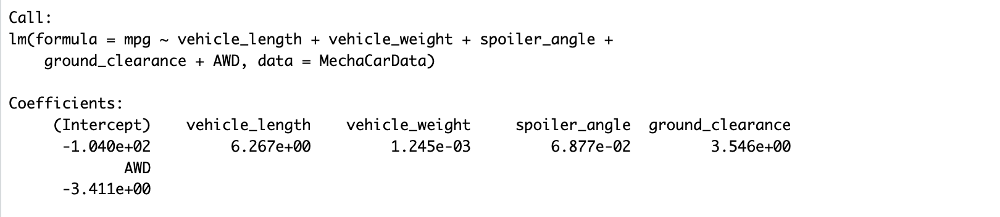
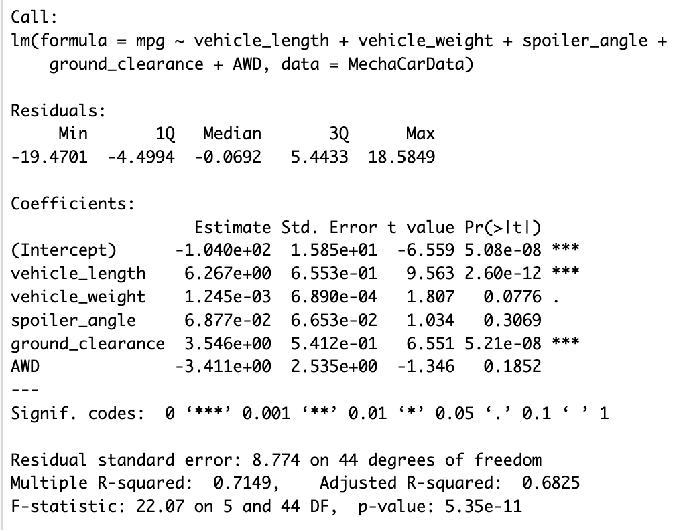
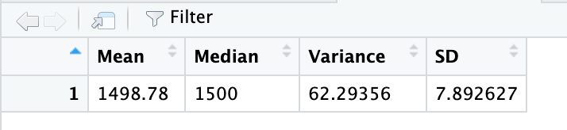
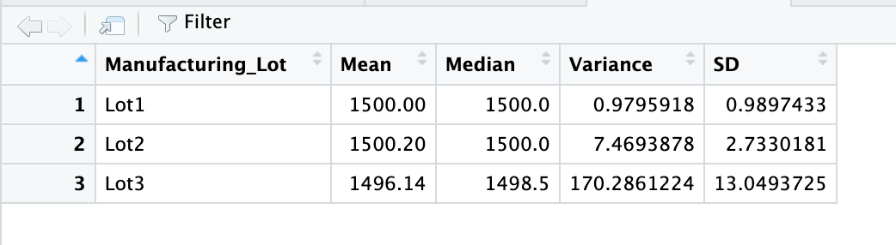
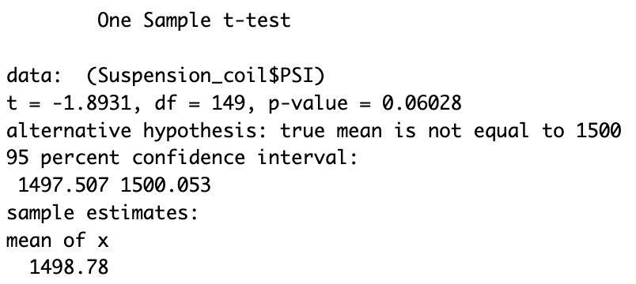
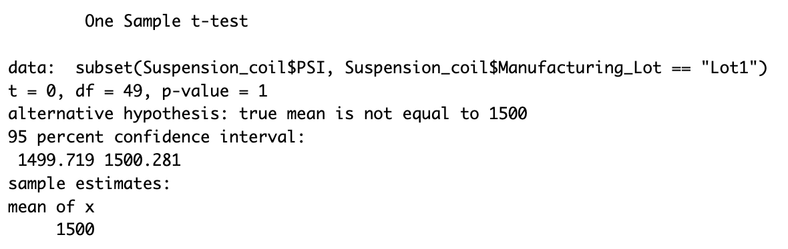
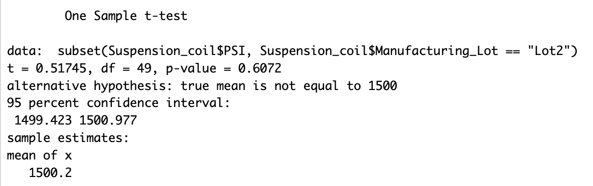
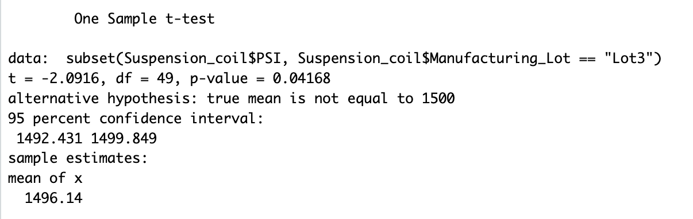

# MechaCar_Statistical_Analysis

# **Purpose**
An auto company called AutosRUs’ had production trouble with its newest prototype, the MechaCar, halting the manufacturing progress. Using the programming language R, statistical analysis, and visualization a review of the production data was conducted to determine the problem.

## **Goal**
- Linear Regression to Predict MPG
- Summary Statistics on Suspension Coils
- T-Test on Suspension Coils
- Design a Study Comparing the MechaCar to the Competition

## **Resources**
- Resources: MechaCar_mpg.csv, Suspension_Coil.csv
- Software: RStudio, R
- Other: Statistics

# **Results**
Multiple tests on MechaCar were done to gather information and insights.

## Linear Regression to Predict MPG
The MechaCar prototypes were produced with differing designs to identify ideal vehicle performance. These differences included vehicle length, vehicle weight, spoiler angle, drivetrain, and ground clearance. A multiple linear regression analysis was performed to identify which variables in the dataset predict the mpg of MechaCar prototypes. Based on the analysis the following questions can be answered: 

 

*Which variables/coefficients provided a non-random amount of variance to the mpg values in the dataset?* The variables that are statistically unlikely to provide random amounts of variance to the model, meaning they have significant impact on mpg are the intercept itself(mpg), vehicle length, and ground clearance.

*Is the slope of the linear model considered to be zero? Why or why not?* To answer this question, it must be understood that the linear regression tests the following hypotheses:
- H0 : The slope of the linear model is zero, or m = 0
- Ha : The slope of the linear model is not zero, or m ≠ 0
In this model, the p-value= 5.35 e-11 which is less than the assumed significance level of .05. Therefore, there is sufficient evidence to reject the null hypothesis, meaning that the slope of the linear model is not zero.

*Does this linear model predict mpg of MechaCar prototypes effectively? Why or why not?* The r squared represents how well the regression model approximates real-world data points. Typically, the r-squared value will range between 0 and 1.  It helps determine the probability or likelihood that a future data point will fit the model. In this case the r squared value is .71, so there is a  probability that 71% of future data points would fit the model. While it is effective at predicting points in our current dataset, there are a lack of significant variables suggesting the model is overfitting. This means it fails to predict future data correctly since it does not generalize. 

## Summary Statistics on Suspension Coils
AutosRus tested multiple production lots for suspension coil data. To determine if the manufacturing process was consistent across production lots the weight capacities of different suspension coils were tested. A summary statistics table was created for:
Suspension coil’s PSI continuous variable across all manufacturing lots. See image below Total Summary:

PSI metrics for each lot: mean, median, variance, and standard deviation. See image below the Lot Summary:

Based on the Analysis the following question can be answered: 
*The design specifications for the MechaCar suspension coils dictate that the variance of the suspension coils must not exceed 100 pounds per square inch. Does the current manufacturing data meet this design specification for all manufacturing lots in total and each lot individually? Why or why not?* In total, the manufacturing lots meet the design specification because the variance is 62.2 which is less than the maximum of 100 psi. However, when broken down by lots, only lot 1 and 2 meet the design specifications having a variance of 1 and 7.5 respectively. Lot 3 fails to meet the requirements with a variance of 170.

## T-Tests on Suspension Coils
Multiple t-tests were run to determine if the manufacturing lots are statistically different from the mean population of 1500 psi.

An RScript using the t.test() function was created to determine if the PSI across all manufacturing lots is statistically different from the population mean of 1,500 pounds per square inch. Recall, a t-test tests the following:
H0 : There is no statistical difference between the observed sample mean and its presumed population mean.
Ha : There is a statistical difference between the observed sample mean and its presumed population mean.

The below image shows the result of running the t-test for all lots. Assuming the significance level was 0.05, the p-value, which is .0602, is above the significance level. Therefore, there is not sufficient evidence to reject the null hypothesis, and the two means are statistically similar.

Three additional RScripts were created using the t.test() function and its subset() argument to determine if the PSI for each manufacturing lot is statistically different from the population mean of 1,500 pounds per square inch.

For lot 1 there is not sufficient evidence to reject the null and the two means are statistically similar because the p-value is 1 which is greater than .05. See the images below:

For lot 2 there is not sufficient evidence to reject the null and the two means are statistically similar because the p-value is .607 which is greater than .05. See the images below:

For lot 3 there is sufficient evidence to reject the null and the two means are statistically different because the p-value is .042 which is less than .05. See the images below:

## Study Design: MechaCar vs Competition

An additional statistical study AutosRUs could perform to anticipate how it will compare to its competition is running an analysis that predicts the prototype’s safety rating by finding variables that have the highest significance/impact on safety. 

In order to complete the study, AutosRUs would need to gather additional data on competitors with similar automobiles to the MechaCar prototype. Ideally this information would span multiple years. This would include the following metrics which will be used to predict the safely rating:
1. Safety rating: Dependent Variable
2. Manufacturer: Independent Variable
3. Model: Independent Variable
4. Class: Independent Variable
5. Weight: Independent Variable
6. Year: Independent Variable
7. Horsepower: Independent Variable
8. Cylinders: Independent Variable

Null hypothesis or alternative hypothesis:
- H0 : The slope of the linear model is zero, or m = 0 There is no relationship between the variables and the safety rating and the dependent variable is determined by random chance and error.
- Ha : The slope of the linear model is not zero, or m ≠ 0 There is a relationship between the variables and the safety rating

A multiple linear regression would be run because it asks if we can predict values for variable A using a linear model and values from variable B. It shows which variables are correlated and have an impact on the dependent variable. In this case. The goal is to predict the safety rating based on multiple variables and determine which ones are most important. 
